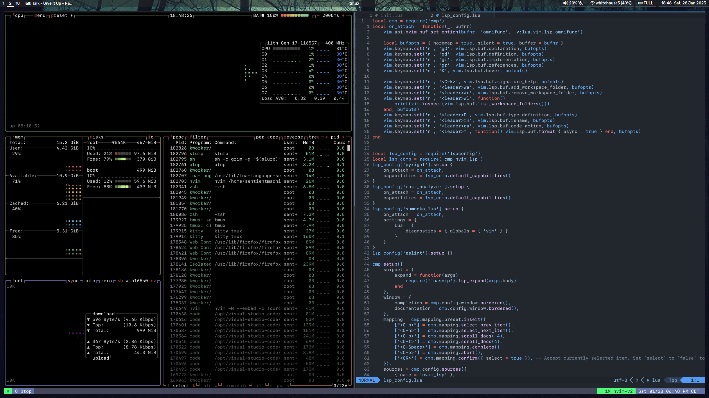

# dotfiles

This repo contains my configuration files for my dev / daily driver environment, which includes:
- `sway` as WM, with a tabbed layout, and `waybar` as control panel
- `wofi` as application launcher
- `kitty` as terminal
- `dunst` as notification manager

## Neovim setup
Neovim is configured to behave similarly to VSCode. Just copy the nvim directory into the `.config` folder.
To make it work you just need to install the Packer plugin manager and you are good to go.

There are some required packages to make it work:
- `fd`
- `typescript-langservers-extracted` (npm or AUR)

It has a bunch of extensions and supports Python, Rust and Typescript, which are the languages I'm currently working with.

